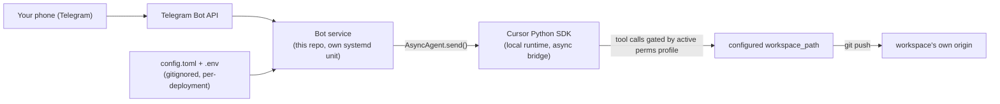

# telegram-cursor-agent

A minimal, non-autonomous Telegram bridge to the Cursor SDK — tool use, doc
writing, and git check-in/commit from a phone, gated by explicit, switchable
permission modes rather than open-ended autonomy.

The tool itself carries no personal data or opinions about any particular
workspace. Everything specific — which repo to operate on, whose Telegram ID
is allowed, which permission profile to run — is external configuration.
Clone it, write your own config, point it at your own repo.

**Status:** persistent session shipped — polling bot, sender allowlist, `/status`,
`/perms`, `/new`, `/cancel`, `locked`/`readonly`/`standard` modes, conversation
survives restarts via jsonl store + sidecar. See [Roadmap](#roadmap).

## What it does

- **Tool use** — send a freeform prompt from Telegram, get an answer/action back.
- **Writing docs** — draft/update files in the configured workspace.
- **Checking in and committing** — review `git status`/diff, draft a commit message, stage, commit, push.
- **Running the workspace's own workflows** — whatever playbooks the target repo defines, on request.

## Non-goals

- No proactive / unsolicited messages — purely call-and-response (no persona loop).
- No multi-repo router — one configured workspace per running instance.
- No cloud SDK runtime — local runtime only, against a fixed, configured `cwd`.
- No custom slash-command grammar for domain actions — natural language does that work.
- No multi-user access — sender allowlist is explicit config, defaulting to nobody.

## Architecture



## Configuration

Two files, both gitignored, both per-deployment:

- **`config.toml`** — copy from [`config.example.toml`](config.example.toml). Which
  workspace to operate on, who's allowed to talk to the bot, default model/permission mode.
- **`.env`** — copy from [`.env.example`](.env.example). Secrets only:
  `TELEGRAM_BOT_TOKEN`, `CURSOR_API_KEY`. Never go in `config.toml`, never committed.

## Permission modes

Switchable at any time with `/perms <mode>` — the power/friction tradeoff is a
conscious, visible choice each session, not baked into the code.

| Mode | Tool access | Git / writes | Sandbox |
|---|---|---|---|
| `locked` | none — bot doesn't forward messages to the agent | never | n/a |
| `readonly` | file read, `git status/diff/log`, fetch/search | never (git revert safety net) | on — workspace fenced |
| `standard` (default) | file read/write in-repo, `git add/commit/push`, repo scripts | yes, including push to remotes outside `workspace_path` (e.g. local bare repos) | **off** — needed when git must write outside the clone (e.g. a bare repo beside it) |
| `interactive` | same as `standard`, plus anything the classifier would otherwise hold | yes, with an Approve/Deny prompt | n/a (not shipped) |

`permissions.json` is loaded via `setting_sources=["project"]`. **Standard** runs
with `auto_review=False` — headless Telegram cannot approve held shell commands.
**Readonly** keeps auto_review on with a narrow `terminalAllowlist`. The sandbox
fences **subprocess** filesystem access; it does not reliably block the native
Write tool (see [Limitations](#limitations)).

Each mode maps to a static profile under [`perms/`](perms/) — reviewable and
diffable like any other config. Tune the allowlists for your workspace.

## Telegram commands

On startup the bot registers these with Telegram's command menu (`setMyCommands`).
Send them as plain `/command` messages (no custom grammar). Anything else is
forwarded to the agent as a freeform prompt.

| Command | Args | What it does |
|---------|------|--------------|
| `/status` | — | Repo snapshot without calling the agent: active mode, model, last commit, `git status --short`, bot uptime. |
| `/perms` | — | Report current mode, model, and available modes. |
| `/perms` | `<mode>` | Switch mode (`locked`, `readonly`, or `standard`). Copies the matching profile into the workspace's `.cursor/` before the next agent call. |
| `/new` | — | Start a fresh agent session, keeping the current model. Conversation history resets; sidecar gets a new `agent_id`. |
| `/new` | `<model>` | Same, but switch model first. Accepts full SDK model IDs or short aliases (`s5`, `c25`, `op` — see [Model IDs](#model-ids)). Unknown names are rejected. |
| `/cancel` | — | Cancel an in-flight agent run. No-op if nothing is running. |

**Not commands:** freeform text (anything that isn't `/…`) goes to the persistent
agent. In `locked` mode the bot acks receipt but does not forward.

While the agent runs: Telegram **typing** indicator stays active, a `working on it…`
message appears, and every **2 minutes** that message is edited with progress
(`~50 steps`, `~80 steps`, …). Progress is cleared on success or failure — typing
stops when the run ends or errors. This is in-flight UX only, not a proactive agent.

On the **first message** after `/new` (or a fresh session), the bot sends a short
ack (`→ agent (standard, claude-sonnet-5)`) and prepends a configurable context
block to the agent prompt (remote server, workspace, mode, model). Customize via
`session_header_template` in `config.toml`.

## Model IDs

Pass full slugs to `/new <model>`, or use built-in aliases. Slugs come from
`Cursor.models.list()` on your account — the list below matches a typical Cursor
account as of 2026-07; run `Cursor.models.list()` if a slug 404s.

### Short aliases (built-in)

| Alias | Resolves to |
|-------|-------------|
| `s5` | `claude-sonnet-5` |
| `s46` | `claude-sonnet-4-6` |
| `s45` | `claude-sonnet-4-5` |
| `c25` | `composer-2.5` |
| `c2` | `composer-2` |
| `op` / `op48` | `claude-opus-4-8` |
| `op46` | `claude-opus-4-6` |
| `haiku` | `claude-haiku-4-5` |
| `auto` | `default` |

Override or extend in `config.toml` under `[model_aliases]`.

### Anthropic (Claude)

| Slug | Display name |
|------|----------------|
| `claude-sonnet-5` | Sonnet 5 |
| `claude-sonnet-4-6` | Sonnet 4.6 |
| `claude-sonnet-4-5` | Sonnet 4.5 |
| `claude-sonnet-4` | Sonnet 4 |
| `claude-opus-4-8` | Opus 4.8 |
| `claude-opus-4-7` | Opus 4.7 |
| `claude-opus-4-6` | Opus 4.6 |
| `claude-opus-4-5` | Opus 4.5 |
| `claude-haiku-4-5` | Haiku 4.5 |
| `claude-fable-5` | Fable 5 |

### Cursor

| Slug | Display name |
|------|----------------|
| `composer-2.5` | Composer 2.5 |
| `composer-2` | Composer 2 |
| `default` | Auto |

### OpenAI

| Slug | Display name |
|------|----------------|
| `gpt-5.5` | GPT-5.5 |
| `gpt-5.4` | GPT-5.4 |
| `gpt-5.4-mini` | GPT-5.4 Mini |
| `gpt-5.4-nano` | GPT-5.4 Nano |
| `gpt-5.2` | GPT-5.2 |
| `gpt-5.2-codex` | Codex 5.2 |
| `gpt-5.3-codex` | Codex 5.3 |
| `gpt-5.1` | GPT-5.1 |
| `gpt-5.1-codex-max` | Codex 5.1 Max |
| `gpt-5.1-codex-mini` | Codex 5.1 Mini |
| `gpt-5-mini` | GPT-5 Mini |

### Google (Gemini)

| Slug | Display name |
|------|----------------|
| `gemini-3.1-pro` | Gemini 3.1 Pro |
| `gemini-3.5-flash` | Gemini 3.5 Flash |
| `gemini-3-flash` | Gemini 3 Flash |
| `gemini-2.5-flash` | Gemini 2.5 Flash |

### Other

| Slug | Display name |
|------|----------------|
| `grok-4.3` | Grok 4.3 |
| `grok-build-0.1` | Grok Build 0.1 |
| `glm-5.2` | GLM 5.2 |
| `kimi-k2.7-code` | Kimi K2.7 Code |

## Example workflows

Quick checks — no agent round-trip:

```
/status
/perms
```

Read-only recon before changing anything:

```
/perms readonly
What's changed since the last commit? Summarize the diff.
```

Standard edit/commit from the phone:

```
/perms standard
Update the README section on X. Show me the diff, then commit with a sensible message.
```

Fresh context (new topic, or after a bad/stale session):

```
/new
Draft a short runbook for restarting this service and rotating secrets.
```

Switch model mid-session:

```
/new s5
/new c25
/new op
```

Kill switch when you only want to queue messages, not run the agent:

```
/perms locked
```

(Anything you send is acked but not forwarded until `/perms standard` or `/perms readonly`.)

Abort a run that's taking too long:

```
/cancel
```

Typical session shape: `/status` → set mode with `/perms` → freeform prompts →
`/new` when context gets muddy → `/cancel` if a run hangs.

## Quickstart

Requires Python 3.12+.

1. Clone and install:

```bash
python3 -m venv .venv
source .venv/bin/activate
pip install -e ".[dev]"
```

2. Copy examples and fill them in:

```bash
cp config.example.toml config.toml   # workspace_path + your Telegram user id(s)
cp .env.example .env                 # TELEGRAM_BOT_TOKEN + CURSOR_API_KEY
```

3. Run from the repo root (so `config.toml` / `.env` resolve):

```bash
python -m telegram_cursor_agent.bot
```

4. In Telegram, message your bot: `/status`, then `/perms readonly` and a prompt.

Optional local checks / git hook:

```bash
./scripts/check.sh          # black, ruff, mypy, guard greps, pytest --cov
chmod +x .githooks/pre-commit
ln -sf "$(pwd)/.githooks/pre-commit" .git/hooks/pre-commit
```

## Security

- Keep `.env` and `config.toml` out of git (already gitignored). Never commit tokens or API keys.
- Only Telegram user IDs in `allowed_sender_ids` can talk to the bot.
- In `standard` mode the agent can run shell with sandbox off — treat `CURSOR_API_KEY` (and anything else in the process environment) as **leakable**. Do not ask the agent to dump `env` / `printenv`. Prefer a dedicated Cursor API key for this bot.
- Give the bot its **own** Telegram token. Do not share a token with another polling process (Telegram allows only one `getUpdates` consumer per bot).

## Limitations

Honest gaps on Cursor SDK **1.0.24** (the version this bot targets). Starting with
`1.0.24`, the Python package and `@cursor/sdk` share one version and are built
from the same commit — Python jumps from `0.1.9` to `1.0.24` with no missing
releases in between; that does not change the public-beta status.

- **`interactive` is not shipped** — there is no held-call approve/deny hook in this SDK version.
- **`readonly` is not preToolUse-enforced** — permissions.json, sandbox, and hooks.json do not reliably block the native Write tool. Enforcement is `guard_writes()`: snapshot git state, revert if the agent wrote.
- **`standard` runs with sandbox off and `auto_review=False`** — required for headless Telegram and for git push layouts that write outside the clone.
- **No multi-workspace routing, no proactive agent, no persona store** — one `workspace_path`, call-and-response only.

## Release

Versioning is semver in `pyproject.toml` (`[project].version`). Tags: `vX.Y.Z`.

Suggested release checklist:

1. Bump version → `./scripts/check.sh` → commit on `main`.
2. `git tag -a vX.Y.Z -m "…"` and push the tag.
3. Deploy the tagged commit to your host (rsync, `git pull`, or your own pipeline). Keep `config.toml` / `.env` / `data/` on the host only.
4. Restart your process manager (systemd unit name is yours to choose).

Operator-specific host paths and SSH details stay out of this README on purpose.

## Roadmap

0. ~~**Repo scaffolding**~~ — pyproject, tooling, license, config templates.
1. ~~**Spike**~~ — cursor-sdk auth; `interactive` not shippable in V1; default model id.
2. ~~**Service skeleton**~~ — allowlist, modes, `/status`, `/perms`.
3. ~~**Persistent session**~~ — session store, `/new [model]`, `/cancel`, `locked`.
4. **Interactive mode** — inline-keyboard approve/deny, if/when the SDK supports it.
5. ~~**Telegram command menu**~~ — `setMyCommands` on startup.

## License

MIT — see [LICENSE](LICENSE).
